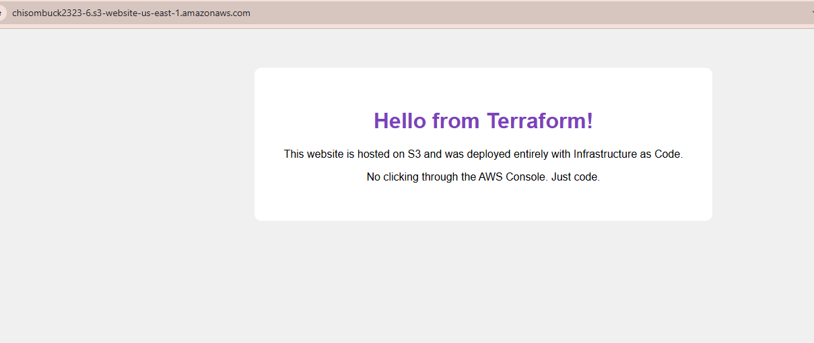

#Terraform - Building a Static Website on  S3 bucket

## Clone this Repo

## Run the App

```
# Initialise Terraform (downloads providers)
terraform init

# Preview the infrastructure changes
terraform plan

# Apply the configuration
```
terraform apply
``
remove the bucket content  - `aws s3 rm s3://my-bucket-name --recursive`


# When finished, destroy the resources

terraform destroy

```
or you can add this on your bucket main.tf
force_destroy = true

